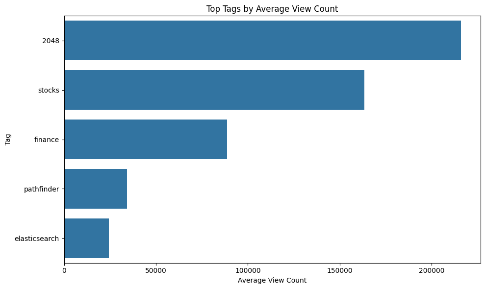

## Repository name
Your repostiory should be named something like `async-final-project-color-name`
Example: `async-final-project-teal-Anas`

## Dataset
[Emerging Technologies](https://www.kaggle.com/datasets/heemalichaudhari/emerging-technologies)

## Why did I chose this dataset?
I  chose this dataset because I’m interested in how emerging technologies like AI, IoT, and Blockchain are changing industries and creating new opportunities. It also connects to my studies in technology and lets me practice data analysis on a topic I care about.

## Progress
- [ ] Picked dataset
- [ ] Defined 10 questions
- [ ] Answered 10 questions using Pandas
- [ ] Added at least one data visualization (using Matplotlib and/or Seaborn) to each single question
- [ ] Prepared presentation slides to present at graduation

## Questions
- [ ] Question 1: What are the top 10 most common tags 
 (rank tags by popularity)
  - Answer: artificial-intelligence , machine-learning  ,neural-network , algorithm , python  , java , c# ,  nlp  ,tensorflow   , c++       
- Visualization: 

- [ ] Question 2: 	Which tags has the highest average score?
  - Answer: stocks
finance
security
sirikit
  - Visualization: 

- [ ] Question 3:Which tags have the highest average number of comments?
  - Answer:  imshow
hashtable
self-modifying
transform
cpu-speed
  - Visualization: 

- [ ] Question 4: Which tags have the highest average view counts?
	
  - Answer: 2048
stocks
finance
pathfinder
elasticsearch
  - Visualization: 
- [ ] Question 5:	Which tags have the highest average number of answers?
	
  - Answer: artificial-intelligence
memory-leaks
...
operating-system
neurolab
lookup-t
  - Visualization: 

- [ ] Question 6: 	What is the average score of the top 5 most common tags?
  - Answer: artificial-intelligence
machine-learning
neural-network
algorithm
python
  - Visualization: 

- [ ] Question 7: 	What is the average view count of the top 5 tags with the highest average score?
  - Answer: 2048
stocks
finance
security
sirikit
  - Visualization: 

- [ ] Question 8: Which tags have a count of tags greater than 500?
  - Answer:artificial-intelligence
machine-learning
neural-network
algorithm
python
  - Visualization: 

- [ ] Question 9: What is the average comment count for tags with more than 1000 questions?
  - Answer: artificial-intelligence
machine-learning
  - Visualization: 

- [ ] Question 10:	What are the tags with an average answer count below 1.5?
  - Answer: apache-spark-mllib
graphic
...
julia-lang
grails
gradient
intellij-idea
  - Visualization: 

